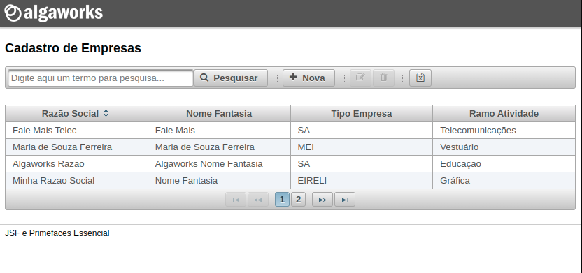
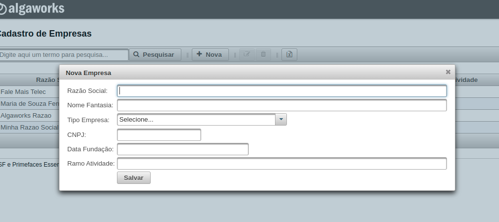
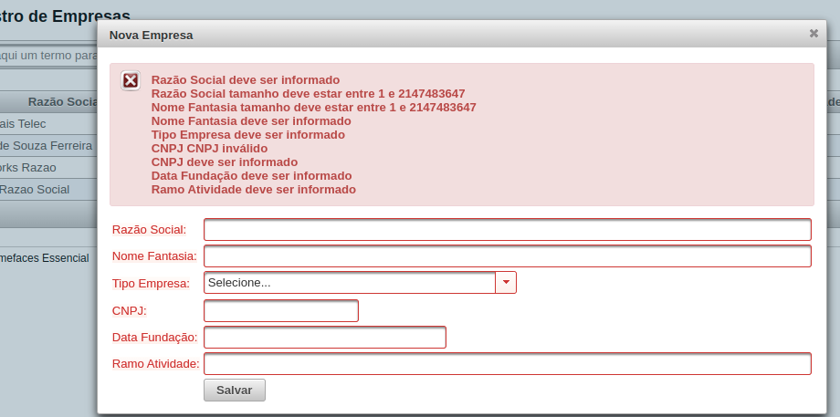
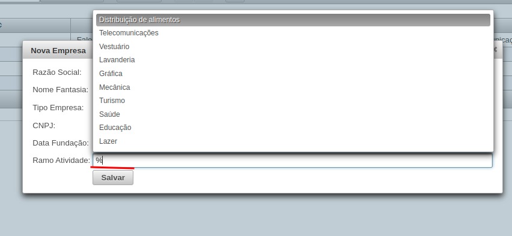
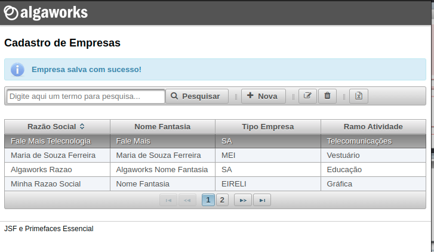

# gestao-empresa-jsf

- Projeto desenvolvido em Java 8, utilizando JSF com Primefaces, CDI, Hibernate, MySQL e Maven

- como executar: após configurar um servidor de aplicação ou um container de aplicação como o Apache Tomcat, sendo servido na porta 8080,
acessar a seguinte URL no browser: http://localhost:8080/gestao-empresa-jsf/index.xhtml

### comandos úteis do Maven:

- mvn clean install
- mvn generate-sources
- mvn clean package

### algumas telas e funcionalidades do projeto

- Tela inicial com toolbar, search box e data table com paginação

- Dialog pra salvar/editar empresas

- Dialog com as validações sendo exibidas

- Pesquisa com autocomplete

- Cadastro com mensagem de sucesso

